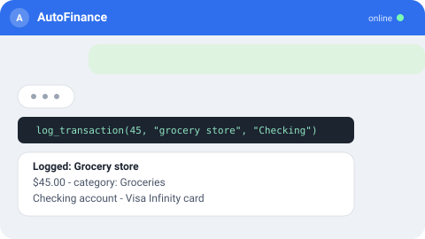

<p align="center">
  
</p>

🇧🇷 [Português](README.md) | 🇺🇸 English | 🇪🇸 [Español](README.es.md)

[](https://github.com/rasecdev/AutoFinance/actions/workflows/ci.yml)
[](LICENSE)


Personal finance bot over Telegram. You describe what happened in natural language — text, photo, PDF, email — and the AI interprets it and decides which action to take; every financial calculation is always deterministic code, never the AI "guessing" a number. The backend is the source of truth: history and financial data live in your own database, never in the AI provider.

<p align="center">
  
</p>

## Why it exists

Besides solving a real problem (financial control without the friction of opening an app and filling out a form), this project is publicly documented as a case study of applied AI usage — architecture decisions, an in-house benchmark, and the reasoning behind every choice (including when research points to *not* doing something) are kept as a living log in [PROGRESSO.md](PROGRESSO.md) (in Portuguese). Full design in [PLANO.md](PLANO.md), product summary in [PRD.md](PRD.md) (also in Portuguese).

## How it works

The AI never calculates money nor has direct database access — it picks which function (*tool*) to call from a fixed JSON schema, and the backend runs the actual calculation. Classic function calling, five steps:

<p align="center">
  
</p>

1. **Message** — user writes in natural language.
2. **Schemas** — the AI receives the JSON schema of every registered function (tool).
3. **Tool call** — the model extracts the arguments from the message and assembles the chosen function call.
4. **Execution** — the backend runs the function (deterministic code) and returns the result.
5. **Response** — the AI formats the return value into a readable reply for the user.

High-impact actions (paying down a debt, deleting a transaction, renegotiating) always require explicit confirmation before executing — the AI never acts on real uncertainty.

## Cache

Two independent layers, each solving a different problem:

- **Native provider prompt caching** — keyed by content + model by OpenRouter/Anthropic itself, no extra logic in the bot; reduces token cost on long conversations with no risk of cross-model contamination.
- **Categorization cache** (`cache_categorizacao`) — normalized description (trim + lowercase + accent removal) → category. Once a description has been seen before, the backend resolves the category deterministically and **authoritatively** — even if the AI suggests a different one in the same call, the cached category wins. Correcting the category on an edit overwrites the cache with `origem: usuario`; from then on the AI never "re-guesses" that description again.

## Features

**Day-to-day logging**
- Log an expense/income just by describing it in text, photo or PDF, no form.
- Transfer between accounts, with a fee when the bank charges one.
- Edit or delete a wrong entry (deletion is always logical/soft).

**Debts and credit cards**
- Loan/financing/payroll loan with installments generated automatically.
- Real simulation and paydown (deterministic Price/SAC amortization calculation).
- Renegotiate without losing the original debt's history.

**Queries and overview**
- Dynamic query and chart for any question outside the fixed tools.
- Consolidated net worth and cash-flow projection.
- On-demand daily report plus automatic weekly/monthly reports.

**Trust in AI usage**
- Model routing mechanism per task type, already implemented and tested (see caveat in "Project status").
- Observability: every AI interaction is logged and traceable.
- Token cost report, compared against reference models.

## Tech stack

| Layer | Technology |
|---|---|
| Runtime | [Node.js](https://nodejs.org/) 22+ / [TypeScript](https://www.typescriptlang.org/) |
| Bot | [grammY](https://grammy.dev/) (Telegram) |
| AI | [OpenRouter](https://openrouter.ai/), routed by flow (SDK [`openai`](https://www.npmjs.com/package/openai)) |
| Database | Encrypted SQLite ([`better-sqlite3-multiple-ciphers`](https://www.npmjs.com/package/better-sqlite3-multiple-ciphers)), plain SQL migrations |
| Validation | [Zod](https://zod.dev/) |
| Logging | [Pino](https://getpino.io/) |
| Tests | [Vitest](https://vitest.dev/) |
| Deploy | [Docker Compose](https://docs.docker.com/compose/), isolated environments (Staging / Production) |

## Project status

| Phase | Delivery | Status |
|---|---|---|
| 1 | Skeleton: bot, database, Docker, environments, allowlist, observability | ✅ Done |
| 2 | Public case study (project documentation/outreach) | ⏸ Postponed |
| 3 | Tool calling: log/query/edit, debts, high-impact confirmation | ✅ Done |
| 4 | Conversation context and memory | ✅ Done |
| 5 | AI routing by flow + price monitoring | 🚧 Partial |
| 6 | Automated reports, internal benchmark, assisted categorization | 🚧 In progress |
| 7 | Email integration (invoices/installments) and Google Calendar | ⬜ Not started |
| 8 | Bank aggregation via Open Finance (Pluggy) | ⬜ Not started |

> **Note on Phase 5:** the flow-based routing mechanism (`roteamento_tarefas` table) is implemented and tested, but today no flow has a different model configured — everything falls back to the same default (`openai/gpt-4o-mini`). In practice, a single model handles everything until the table is actually populated.

Full log, with the reasoning behind every decision, in [PROGRESSO.md](PROGRESSO.md) (in Portuguese).

## Infrastructure

<p align="center">
  <picture>
    <source media="(max-width: 600px)" srcset="docs/assets/infra-diagram.svg">
    
  </picture>
</p>

Hosted on Oracle Cloud's free tier ("Always Free") — a single VM runs both environments side by side, each as a separate service in the same `docker-compose.yml`. The branch maps to the environment: `development` runs the Staging service, `master` runs Production — and promoting one to the other is never automatic, it only happens by explicit decision after real manual testing.

## Running locally

<details>
<summary>Docker Compose (Staging)</summary>

```bash
cp .env.example .env.homologacao   # fill in TELEGRAM_BOT_TOKEN, TELEGRAM_ALLOWED_CHAT_IDS, etc.
docker compose up -d homologacao
```

Environments are isolated by branch and by service in `docker-compose.yml` — `development` maps to Staging, `master` maps to Production (never promoted automatically, always by explicit decision after real manual testing).

</details>

## Security and privacy

- Telegram user allowlist — only authorized chat IDs can interact with the bot.
- Database encrypted at rest (SQLCipher via `better-sqlite3-multiple-ciphers`).
- Secrets never committed — Gitleaks pre-commit hook, also run in CI.
- Personal use, single-user by design — there is no multi-user flow.
- Deletion is always logical: no data ever truly disappears from the history.

## License

[MIT](LICENSE)
