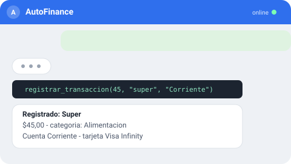
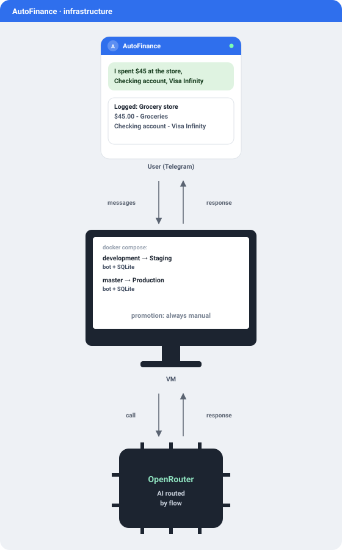

# AutoFinance

🇧🇷 [Português](README.md) | 🇺🇸 [English](README.en.md) | 🇪🇸 Español

[](https://github.com/rasecdev/AutoFinance/actions/workflows/ci.yml)
[](LICENSE)


Bot financiero personal vía Telegram. Describís lo que pasó en lenguaje natural — texto, foto, PDF, correo — y la IA interpreta y decide qué acción tomar; todo cálculo financiero es siempre código determinístico, la IA nunca "adivina" un número. El backend es la fuente de verdad: el historial y los datos financieros viven en tu propia base de datos, nunca en el proveedor de IA.



## Por qué existe

Además de resolver un problema real (control financiero sin la fricción de abrir una app y llenar un formulario), este proyecto se documenta públicamente como caso de estudio de uso aplicado de IA — decisiones de arquitectura, benchmark propio y el porqué de cada elección (incluso cuando la investigación apunta a *no* hacer algo) quedan registrados como un log vivo en [PROGRESSO.md](PROGRESSO.md) (en portugués). Diseño completo en [PLANO.md](PLANO.md), resumen de producto en [PRD.md](PRD.md) (también en portugués).

## Cómo funciona

La IA nunca calcula dinero ni tiene acceso directo a la base de datos — elige qué función (*tool*) llamar a partir de un schema JSON fijo, y el backend ejecuta el cálculo real. Function calling clásico, en cinco pasos:



1. **Mensaje** — el usuario escribe en lenguaje natural.
2. **Schemas** — la IA recibe el schema JSON de todas las funciones registradas (tools).
3. **Tool call** — el modelo extrae los argumentos del mensaje y arma la llamada a la función elegida.
4. **Ejecución** — el backend ejecuta la función (código determinístico) y devuelve el resultado.
5. **Respuesta** — la IA formatea el resultado en una respuesta legible para el usuario.

Las acciones de alto impacto (amortizar deuda, eliminar una transacción, renegociar) siempre pasan por confirmación explícita antes de ejecutarse — la IA nunca actúa ante una incertidumbre real.

## Cache

Dos capas independientes, cada una resolviendo un problema distinto:

- **Prompt caching nativo del proveedor** — indexado por contenido + modelo por el propio OpenRouter/Anthropic, sin lógica extra en el bot; reduce el costo de tokens en conversaciones largas sin riesgo de contaminación entre modelos.
- **Cache de categorización** (`cache_categorizacao`) — descripción normalizada (trim + minúsculas + remoción de acentos) → categoría. Cuando la descripción ya fue vista antes, el backend resuelve la categoría de forma determinística y **autoritativa** — incluso si la IA sugiere otra en la misma llamada, prevalece la categoría cacheada. Corregir la categoría al editar sobrescribe el cache con `origem: usuario`; desde ese momento la IA nunca más "vuelve a adivinar" esa descripción.

## Funcionalidades

**Registro del día a día**
- Registrar un gasto/ingreso solo describiéndolo en texto, foto o PDF, sin formularios.
- Transferencia entre cuentas, con comisión cuando el banco la cobre.
- Editar o eliminar un registro incorrecto (la eliminación siempre es lógica).

**Deudas y tarjetas**
- Préstamo/financiación/crédito con cuotas generadas automáticamente.
- Simulación y amortización real (cálculo determinístico Price/SAC).
- Renegociación sin perder el historial de la deuda original.

**Consultas y visión general**
- Consulta dinámica y gráfico para cualquier pregunta fuera de las tools fijas.
- Patrimonio neto consolidado y proyección de flujo de caja.
- Reporte diario bajo demanda más reportes semanal/mensual automáticos.

**Confianza en el uso de IA**
- Mecanismo de enrutamiento de modelo por tipo de tarea, ya implementado y probado (ver la salvedad en "Estado del proyecto").
- Observabilidad: cada interacción de IA queda registrada y es rastreable.
- Reporte de costo de tokens, comparado contra modelos de referencia.

## Stack técnico

| Capa | Tecnología |
|---|---|
| Runtime | [Node.js](https://nodejs.org/) 22+ / [TypeScript](https://www.typescriptlang.org/) |
| Bot | [grammY](https://grammy.dev/) (Telegram) |
| IA | [OpenRouter](https://openrouter.ai/), enrutado por flujo (SDK [`openai`](https://www.npmjs.com/package/openai)) |
| Base de datos | SQLite cifrado ([`better-sqlite3-multiple-ciphers`](https://www.npmjs.com/package/better-sqlite3-multiple-ciphers)), migraciones en SQL puro |
| Validación | [Zod](https://zod.dev/) |
| Logs | [Pino](https://getpino.io/) |
| Tests | [Vitest](https://vitest.dev/) |
| Deploy | [Docker Compose](https://docs.docker.com/compose/), entornos aislados (Staging / Producción) |

## Estado del proyecto

| Fase | Entrega | Estado |
|---|---|---|
| 1 | Esqueleto: bot, base de datos, Docker, entornos, allowlist, observabilidad | ✅ Completada |
| 2 | Caso de estudio público (documentación/difusión del proyecto) | ⏸ Postergada |
| 3 | Tool calling: registrar/consultar/editar, deudas, confirmación de alto impacto | ✅ Completada |
| 4 | Contexto y memoria de conversación | ✅ Completada |
| 5 | Enrutamiento de IA por flujo + monitoreo de precio | 🚧 Parcial |
| 6 | Reportes automáticos, benchmark interno, categorización asistida | 🚧 En curso |
| 7 | Integración con correo (factura/cuota) y Google Calendar | ⬜ No iniciada |
| 8 | Agregación bancaria vía Open Finance (Pluggy) | ⬜ No iniciada |

> **Nota sobre la Fase 5:** el mecanismo de enrutamiento por flujo (tabla `roteamento_tarefas`) está implementado y probado, pero hoy ningún flujo tiene un modelo distinto configurado — todos caen en el mismo modelo por defecto (`openai/gpt-4o-mini`). En la práctica, un único modelo atiende todo hasta que la tabla se pueble de verdad.

Log completo, con el porqué de cada decisión, en [PROGRESSO.md](PROGRESSO.md) (en portugués).

## Infraestructura



Hospedaje en la capa gratuita de Oracle Cloud ("Always Free") — una única VM ejecuta los dos entornos lado a lado, cada uno como un servicio separado del mismo `docker-compose.yml`. La branch mapea el entorno: `development` levanta el servicio de Staging, `master` levanta el de Producción — y la promoción de uno a otro nunca es automática, solo ocurre por decisión explícita después de una prueba manual real.

## Ejecutar localmente

<details>
<summary>Docker Compose (Staging)</summary>

```bash
cp .env.example .env.homologacao   # completar TELEGRAM_BOT_TOKEN, TELEGRAM_ALLOWED_CHAT_IDS, etc.
docker compose up -d homologacao
```

Los entornos están aislados por branch y por servicio del `docker-compose.yml` — `development` mapea a Staging, `master` mapea a Producción (nunca se promueve automáticamente, siempre por decisión explícita después de una prueba manual real).

</details>

## Seguridad y privacidad

- Allowlist de usuarios de Telegram — solo los chat IDs autorizados pueden interactuar con el bot.
- Base de datos cifrada en reposo (SQLCipher vía `better-sqlite3-multiple-ciphers`).
- Los secretos nunca se commitean — hook de pre-commit con Gitleaks, también ejecutado en CI.
- Uso personal, single-user por diseño — no existe un flujo multiusuario.
- Eliminación siempre lógica: ningún dato desaparece realmente del historial.

## Licencia

[MIT](LICENSE)
