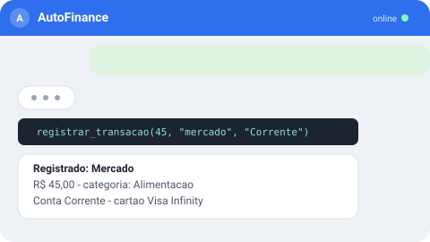
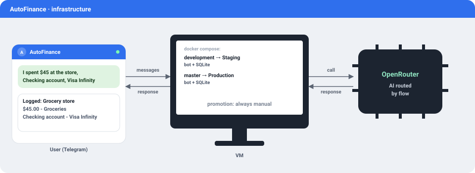

<p align="center">
  
</p>

<p align="center">
  🇧🇷 Português | 🇺🇸 <a href="README.en.md">English</a> | 🇪🇸 <a href="README.es.md">Español</a>
</p>

<p align="center">
  <a href="https://github.com/rasecdev/AutoFinance/actions/workflows/ci.yml"></a>
  <a href="LICENSE"></a>
  
  
</p>

Bot financeiro pessoal via Telegram. Você descreve o que aconteceu em linguagem natural — texto, foto, PDF, e-mail — e a IA interpreta e decide qual ação tomar; todo cálculo financeiro é sempre código determinístico, nunca a IA "achando" um número. O backend é a fonte de verdade: histórico e dado financeiro moram no seu próprio banco, nunca no provedor de IA.

<p align="center">
  
</p>

## Por que existe

Além de resolver um problema real (controle financeiro sem o atrito de abrir app e preencher formulário), este projeto é documentado publicamente como estudo de caso de uso de IA aplicada — decisões de arquitetura, benchmark próprio e o porquê de cada escolha (inclusive quando a pesquisa aponta pra *não* fazer algo) ficam registrados vivos em [PROGRESSO.md](PROGRESSO.md). Design completo em [PLANO.md](PLANO.md), resumo de produto em [PRD.md](PRD.md).

## Como funciona

A IA nunca calcula dinheiro nem tem acesso direto ao banco — ela escolhe qual função (*tool*) chamar a partir de um schema JSON fixo, e o backend executa o cálculo real. Function calling clássico, cinco etapas:

<p align="center">
  
</p>

1. **Mensagem** — usuário escreve em linguagem natural.
2. **Schemas** — a IA recebe o JSON schema de todas as funções registradas (tools).
3. **Tool call** — o modelo extrai os argumentos da mensagem e monta a chamada da função escolhida.
4. **Execução** — o backend roda a função (código determinístico) e devolve o resultado.
5. **Resposta** — a IA formata o retorno numa resposta legível pro usuário.

Ações de alto impacto (amortizar dívida, excluir transação, renegociar) sempre passam por confirmação explícita antes de executar — a IA nunca age sobre incerteza real.

## Cache

Duas camadas independentes, cada uma resolvendo um problema diferente:

- **Prompt caching nativo do provedor** — chaveado por conteúdo + modelo pelo próprio OpenRouter/Anthropic, sem lógica extra no bot; reduz custo de tokens em conversas longas sem risco de contaminação entre modelos.
- **Cache de categorização** (`cache_categorizacao`) — descrição normalizada (trim + lowercase + remoção de acento) → categoria. Quando a descrição já foi vista antes, o backend resolve a categoria de forma determinística e **autoritativa** — mesmo que a IA sugira outra na mesma chamada, a categoria cacheada prevalece. Corrigir a categoria numa edição sobrescreve o cache com `origem: usuario`; a partir daí a IA nunca mais "re-adivinha" aquela descrição.

## Funcionalidades

**Registro do dia a dia**
- Registrar gasto/receita por texto, foto ou PDF, sem formulário.
- Transferência entre contas, com taxa quando o banco cobrar.
- Editar ou excluir lançamento errado (exclusão sempre lógica).

**Dívidas e cartão**
- Empréstimo/financiamento/consignado com parcelas geradas automaticamente.
- Simulação e amortização real (cálculo Price/SAC determinístico).
- Renegociação sem perder o histórico da dívida original.

**Consulta e visão geral**
- Consulta dinâmica e gráfico pra qualquer pergunta fora das tools fixas.
- Patrimônio líquido consolidado e projeção de fluxo de caixa.
- Relatório diário sob demanda + semanal/mensal automático.

**Confiança no uso de IA**
- Mecanismo de roteamento de modelo por tipo de tarefa, já implementado e testado (ver ressalva em "Status do projeto").
- Observabilidade: toda interação de IA fica registrada e rastreável.
- Relatório de custo de tokens, com comparação contra modelos de referência.

## Stack técnico

| Camada | Tecnologia |
|---|---|
| Runtime | [Node.js](https://nodejs.org/) 22+ / [TypeScript](https://www.typescriptlang.org/) |
| Bot | [grammY](https://grammy.dev/) (Telegram) |
| IA | [OpenRouter](https://openrouter.ai/), roteado por fluxo (SDK [`openai`](https://www.npmjs.com/package/openai)) |
| Banco | SQLite cifrado ([`better-sqlite3-multiple-ciphers`](https://www.npmjs.com/package/better-sqlite3-multiple-ciphers)), migrações em SQL puro |
| Validação | [Zod](https://zod.dev/) |
| Logs | [Pino](https://getpino.io/) |
| Testes | [Vitest](https://vitest.dev/) |
| Deploy | [Docker Compose](https://docs.docker.com/compose/), ambientes isolados (Homologação / Produção) |

## Status do projeto

| Fase | Entrega | Status |
|---|---|---|
| 1 | Esqueleto: bot, banco, Docker, ambientes, allowlist, observabilidade | ✅ Concluída |
| 2 | Estudo de caso público (documentação/divulgação do projeto) | ⏸ Adiada |
| 3 | Tool calling: registrar/consultar/editar, dívidas, confirmação de alto impacto | ✅ Concluída |
| 4 | Contexto e memória de conversa | ✅ Concluída |
| 5 | Roteamento de IA por fluxo + monitoramento de preço | 🚧 Parcial |
| 6 | Relatórios automáticos, benchmark interno, categorização assistida | 🚧 Em andamento |
| 7 | Integração com e-mail (fatura/boleto) e Google Calendar | ⬜ Não iniciada |
| 8 | Agregação bancária via Open Finance (Pluggy) | ⬜ Não iniciada |

> **Nota sobre a Fase 5:** o mecanismo de roteamento por fluxo (tabela `roteamento_tarefas`) está implementado e testado, mas hoje nenhum fluxo tem modelo diferente configurado — todos caem no mesmo fallback (`openai/gpt-4o-mini`). Na prática, um único modelo atende tudo até a tabela ser populada de verdade.

Log completo, com o porquê de cada decisão, em [PROGRESSO.md](PROGRESSO.md).

## Infraestrutura

<p align="center">
  <picture>
    <source media="(max-width: 600px)" srcset="docs/assets/infra-diagram.svg">
    
  </picture>
</p>

Hospedagem na camada gratuita da Oracle Cloud ("Always Free") — uma única VM roda os dois ambientes lado a lado, cada um como um serviço separado do mesmo `docker-compose.yml`. A branch mapeia o ambiente: `development` sobe o serviço de Homologação, `master` sobe o de Produção — e a promoção de um pro outro nunca é automática, só acontece por decisão explícita depois de teste manual real.

## Rodando localmente

<details>
<summary>Docker Compose (Homologação)</summary>

```bash
cp .env.example .env.homologacao   # preencher TELEGRAM_BOT_TOKEN, TELEGRAM_ALLOWED_CHAT_IDS, etc.
docker compose up -d homologacao
```

Ambientes são isolados por branch e por serviço do `docker-compose.yml` — `development` mapeia Homologação, `master` mapeia Produção (nunca promovido automaticamente, sempre por decisão explícita após teste manual real).

</details>

## Segurança e privacidade

- Allowlist de usuário do Telegram — só chat IDs autorizados interagem com o bot.
- Banco cifrado em repouso (SQLCipher via `better-sqlite3-multiple-ciphers`).
- Segredos nunca commitados — hook de pre-commit com Gitleaks, também rodado no CI.
- Uso pessoal, single-user por desenho — não há fluxo multiusuário.
- Exclusão sempre lógica: nenhum dado desaparece de fato do histórico.

## Licença

[MIT](LICENSE)
